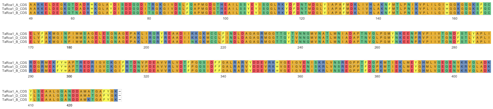

Align and Visualise Sequences in R
================

## Install Packages

You need three packages to create and visualize a sequence alignment.
`Biostrings` is a bioconductor package which is really useful for
loading in sequence data in several formats including ‘.fasta’. `msa` is
a package used for creating multiple sequence alignments. `ggmsa` is a
nice package that will visualize the alignments using ggplot style
functionality.

### To install;

``` r
## BiocManager (Bioconductor Manager) is required to install bioconductor packages as they are hosted in their own repository not on CRAN.
if (!requireNamespace("BiocManager", quietly = TRUE))
    install.packages("BiocManager")

BiocManager::install("Biostrings")
BiocManager::install("msa")

if (!requireNamespace("devtools", quietly=TRUE))
    install.packages("devtools")
devtools::install_github("YuLab-SMU/ggmsa")
```

## Load Packages

``` r
library(Biostrings)
library(msa)
library(ggmsa)
```

## Load the sequences

To import DNA, RNA, or Amino Acid sequences I like to use
`readDNAStringSet()`, `readRNAStringSet()`, or `readAAStringSet`
respectively. Here I import the coding sequences of Rca1 from A, B, and
D sub genomes and load them into a single object `Rca1_CDS`. The
sequences are not yet aligned. Length refers to the number of sequences
within your object. Width refers to the length of each of the sequences.
As you can see the A and D sequences have a width of 1299, and the B
sequence has a width of 1293, you will need these numbers later for
plotting the alignment.

``` r
Rca1_CDS <- readDNAStringSet(c('FastaFiles/TaRca1B_A (TraesCS4A02G177600.1)_CDS.fasta',
                                 'FastaFiles/TaRca1B_B (TraesCS4B02G140200.2)_CDS.fasta',
                                 'FastaFiles/TaRca1B_D (TraesCS4D02G134900.1)_CDS.fasta'))

Rca1_CDS
```

    ## DNAStringSet object of length 3:
    ##     width seq                                               names               
    ## [1]  1299 ATGGCTTCTGCTTTCTCGTCCAC...CCGGCGCCTTCTACGGCAAGTAG TaRca1_A_(TraesCS...
    ## [2]  1293 ATGCGGATGGGGCGGAGGCTATC...CCGGCGCCTTCTACGGCAAGTAG TaRca1_B_(TraesCS...
    ## [3]  1299 ATGGCTTCTGCTTTCTCATCCAC...CCGGCGCCTTCTACGGCAAGTAG TaRca1_D_(TraesCS...

## Align the sequences

Biostrings can perform a sequence alignment of two sequences using
`pairwiseAlignment()`. To align more than two sequences you need to use
the msa (multiple sequence alignment) package. Here I have created the
alignment of the A, B, and D sequences and stored the alignment in a new
object. You can expand this to see the full alignment but it is not very
pretty or easy to read.

``` r
Rca1_CDS_Alignment <- msa(Rca1_CDS)
```

    ## use default substitution matrix

``` r
Rca1_CDS_Alignment
```

    ## CLUSTAL 2.1  
    ## 
    ## Call:
    ##    msa(Rca1_CDS)
    ## 
    ## MsaDNAMultipleAlignment with 3 rows and 1299 columns
    ##     aln                                                    names
    ## [1] ATGGCTTCTGCTTTCTCGTCCACCGT...GACCGGCGCCTTCTACGGCAAGTAG TaRca1_A_(TraesCS...
    ## [2] ATGGCTTCTGCTTTCTCATCCACCGT...GACCGGCGCCTTCTACGGCAAGTAG TaRca1_D_(TraesCS...
    ## [3] ----ATGCGGATGGGGCGGAGGCTAT...GACCGGCGCCTTCTACGGCAAGTAG TaRca1_B_(TraesCS...
    ## Con ATGGCTTCTGCTTTCTCGTCCACCGT...GACCGGCGCCTTCTACGGCAAGTAG Consensus

## Reformat the alignment

Aligning sequences with `msa` returns the alignment in a non
bioconductor friendly format. Calling `DNAStringSet` on the alignment
object will return the alignment in a familiar format for visualizing
the alignment. Now all three sequences have a width of 1299 as the
blanks have been filled in with a dash.

``` r
Rca1_CDS_Alignment <- DNAStringSet(Rca1_CDS_Alignment)
Rca1_CDS_Alignment
```

    ## DNAStringSet object of length 3:
    ##     width seq                                               names               
    ## [1]  1299 ATGGCTTCTGCTTTCTCGTCCAC...CCGGCGCCTTCTACGGCAAGTAG TaRca1_A_(TraesCS...
    ## [2]  1299 ATGGCTTCTGCTTTCTCATCCAC...CCGGCGCCTTCTACGGCAAGTAG TaRca1_D_(TraesCS...
    ## [3]  1299 ----ATGCGGATGGGGCGGAGGC...CCGGCGCCTTCTACGGCAAGTAG TaRca1_B_(TraesCS...

## Visualise the alignment

`ggmsa` is a nice package for visualizing alignments, note this package
does not align your sequences so do make sure that you are using an
object containing aligned sequences. You need to specify a start and end
point, so you can visualize just part of your alignment if you wish.
`facet_msa()` will wrap your alignment x number of characters, 120 in
this example.

``` r
ggmsa(Rca1_CDS_Alignment, 0, 1299, char_width = 0.45, seq_name = TRUE) +
  facet_msa(field = 120)
```

<!-- -->

## Translate and Align Protein Sequences

If you want to also align and visualize protein sequences, you can
either read in amino acid `.fasta` files and repeat the above
instructions but using `readAAStringSet()` and `AAStringSet()`
respectively. Alternatively Biostrings can transcribe and translate the
DNA coding sequence for you, below is a brief example with a protein
alignment.

``` r
Rca1_AA <- translate(Rca1_CDS)
Rca1_AA_Alignment <- msa(Rca1_AA)
```

    ## use default substitution matrix

``` r
Rca1_AA_Alignment <- AAStringSet(Rca1_AA_Alignment)
ggmsa(Rca1_AA_Alignment, 0, 433, char_width = 0.45, seq_name = TRUE) +
  facet_msa(field = 60)
```

<!-- -->
