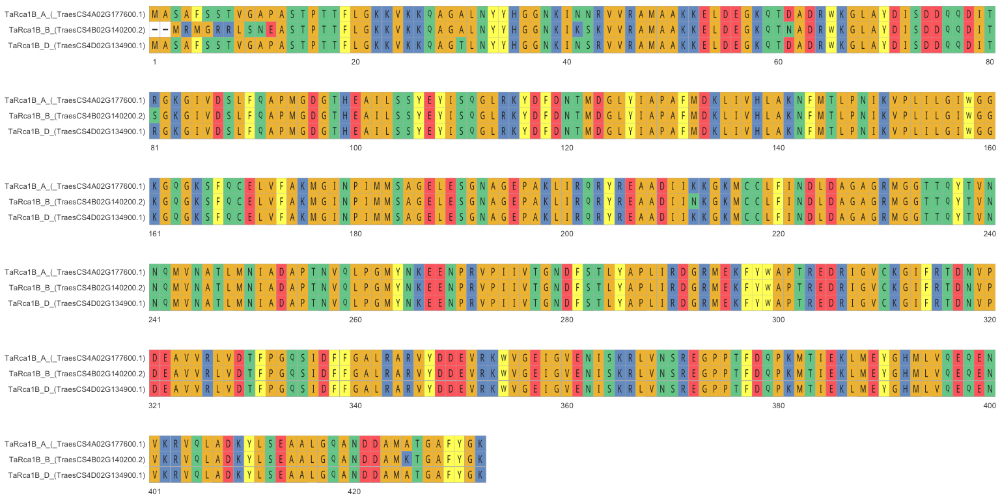

How To Use ggmsa
================

## Install Packages

You need three packages to create an alignment, `Biostrings` is a
Bioconductor package which is really useful for loading in seq data in
several formats including `.fasta`. `msa` is a package used for creating
multiple sequence alignments. `ggmsa` is a really nice package for
visualising pretty/publication alignments which uses ggplot type
functionality.

To install;

``` r
if (!requireNamespace("BiocManager", quietly = TRUE))
    install.packages("BiocManager")

BiocManager::install("Biostrings")
BiocManager::install("msa")

if (!requireNamespace("devtools", quietly=TRUE))
    install.packages("devtools")
devtools::install_github("YuLab-SMU/ggmsa")
```

## Load Packages

``` r
library(Biostrings)
library(msa)
library(ggmsa)
```

## Load Sequences

To import an amino acid .fasta I like to use `readAAStringSet()` from
`Biostrings`. To import DNA or RNA use `readDNAStringSet()` or
`readRNAStringSet()` respectively. (Tip: `Biostrings` will also let you
transcribe a DNA sequence to an RNA sequence, and translate either a DNA
or an RNA sequence to an AA sequence.)

``` r
TaRca1_sequences <- readAAStringSet('TaRca1_AA_Alignment.fasta')
```

I imported the A, B, and D AA sequence of TaRca1 in a single pre-aligned
.fasta, as you can see as this object has a length of 3. Confusingly the
width column here refers to the length of each of your AA sequence, as
you can see the A, B, and D subgenome sequences have a length 432. You
will require the width (length) of your sequences for plotting your
alignment, so now you know where to find them..

``` r
TaRca1_sequences
```

    ## AAStringSet object of length 3:
    ##     width seq                                               names               
    ## [1]   432 MASAFSSTVGAPASTPTTFLGKK...YLSEAALGQANDDAMATGAFYGK TaRca1B_A_(_Traes...
    ## [2]   432 --MRMGRRLSNEASTPTTFLGKK...YLSEAALGQANDDAMKTGAFYGK TaRca1B_B_(TraesC...
    ## [3]   432 MASAFSSTVGAPASTPTTFLGKK...YLSEAALGQANDDAMATGAFYGK TaRca1B_D_(TraesC...

## Create Alignment

Use `ggmsa()` to visualize your alignment. First argument should be your
object containing your sequence alignment. Followed by start and end
range (You can visualize just a region or your entire alignment if you
wish). `facet_msa()` will wrap your alignment by a number of amino
acids, every 120 in this example.

``` r
ggmsa(TaRca1_sequences, 0, 432, font = "DroidSansMono", char_width = 0.50, seq_name = TRUE ) +
facet_msa(field = 80)
```

<!-- -->
